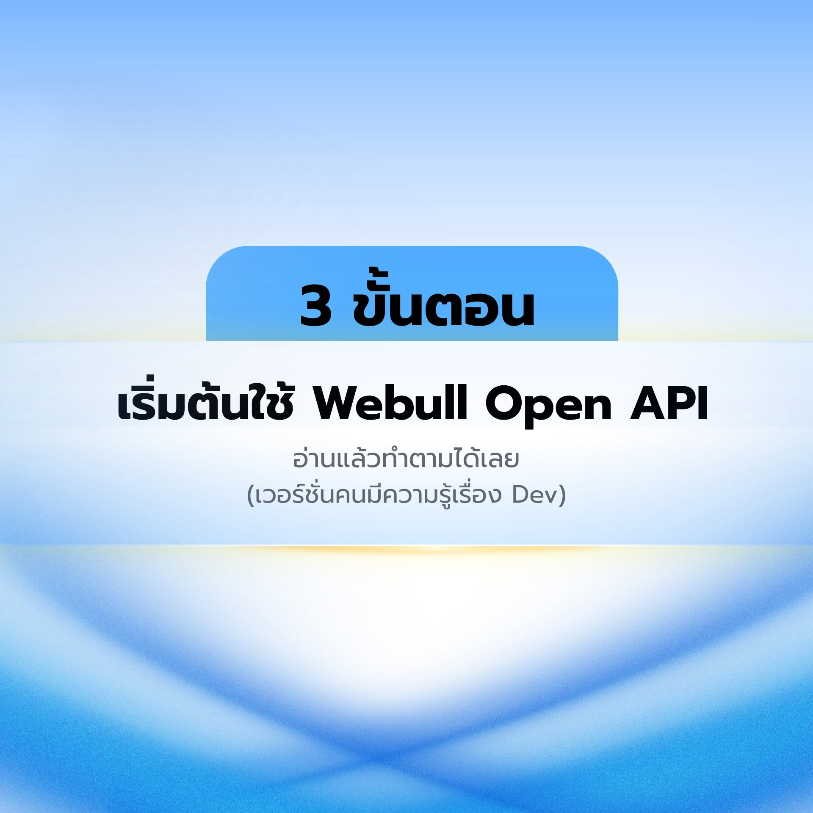
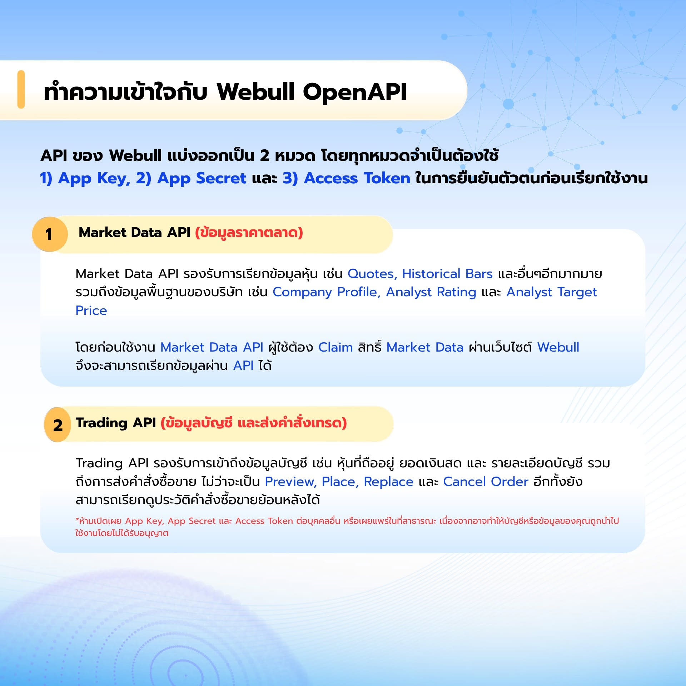
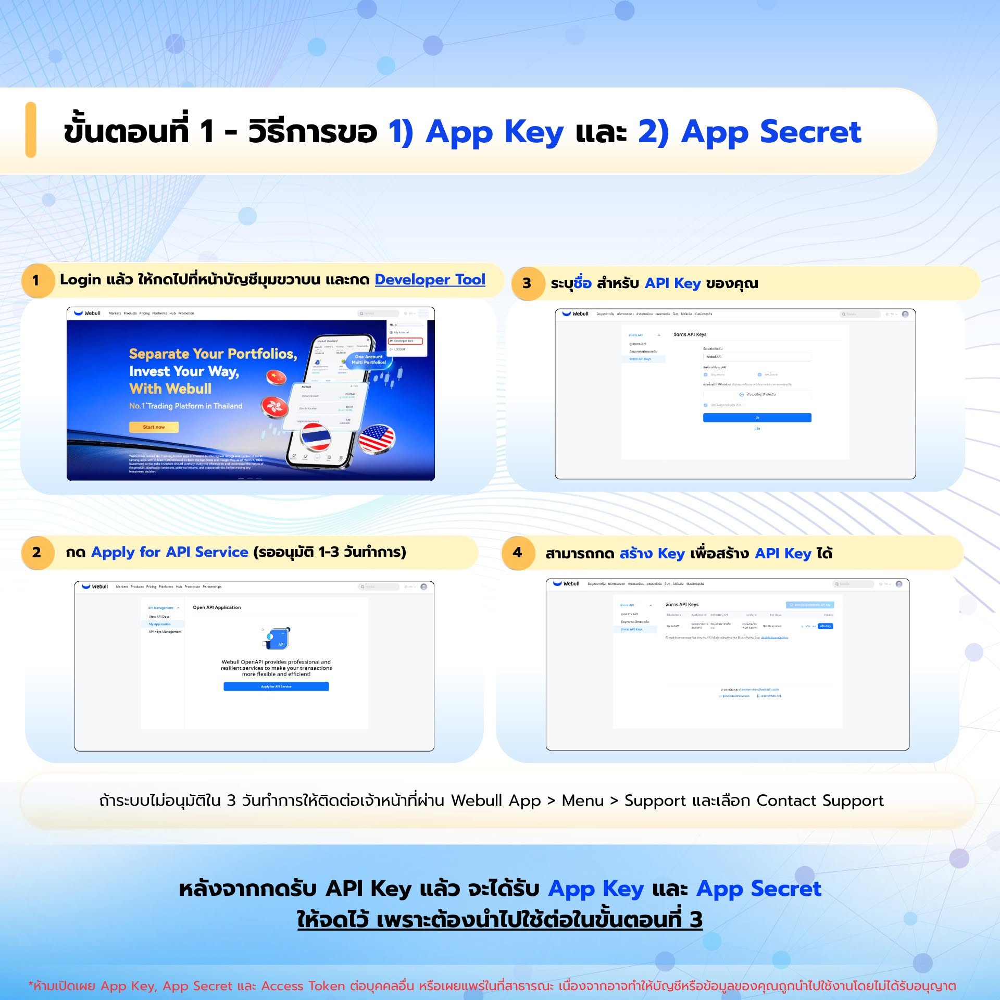
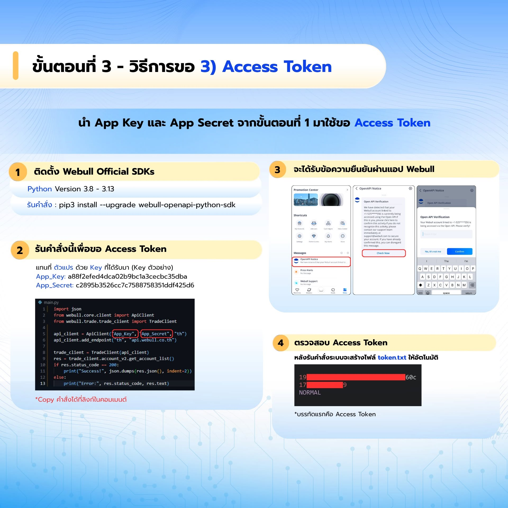
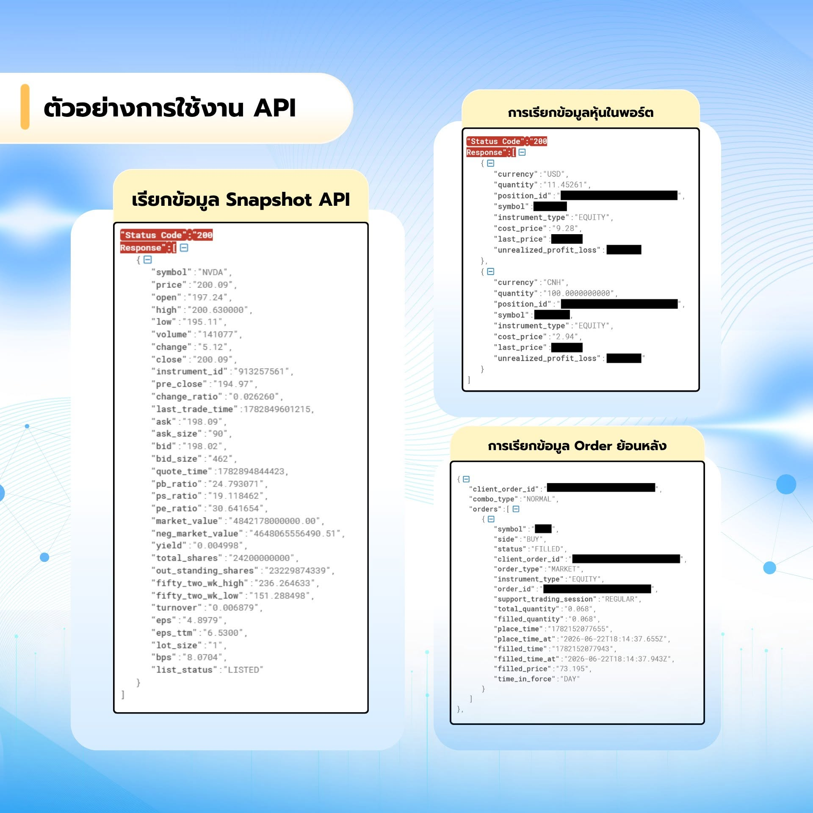

# Webull OpenAPI Thai Lab

[](https://github.com/nutdnuy/webull-openapi-thai-lab/actions/workflows/ci.yml)

คู่มือและตัวอย่างโค้ดภาษา Python สำหรับเรียนรู้ Webull OpenAPI แบบปลอดภัย ตั้งแต่การสร้าง API Key, เรียกบัญชีใน UAT, ดึง Market Data, preview order และวาง guardrail ก่อนแตะคำสั่งซื้อขายจริง

## Visual Quick Start

อ่านภาพรวมก่อนเริ่ม notebook:












## เหมาะกับใคร

- นักลงทุนหรือ quant developer ที่ต้องการทดลอง Webull API อย่างเป็นระบบ
- คนที่ต้องการใช้ AI coding assistant ช่วยอ่านเอกสาร Webull โดยไม่รั่ว secret
- ผู้เรียนที่ต้องการตัวอย่าง Python ที่แยก read-only, market data, และ order workflow ชัดเจน

## หลักความปลอดภัย

- ใช้ UAT เป็นค่าเริ่มต้นเสมอ
- ห้าม commit `App Key`, `App Secret`, token file, account ID ส่วนตัว หรือไฟล์ `.env`
- ตัวอย่าง order เริ่มจาก `preview_order` เท่านั้น
- การ place order ต้องตั้งค่า `WEBULL_ALLOW_LIVE_ORDERS=I_UNDERSTAND` แบบตั้งใจ
- Repo นี้เป็นสื่อการเรียนรู้ ไม่ใช่ระบบ trading production

## Quick Start

```bash
git clone https://github.com/nutdnuy/webull-openapi-thai-lab.git
cd webull-openapi-thai-lab
python -m venv .venv
source .venv/bin/activate
python -m pip install -e ".[dev]"
cp .env.example .env
```

แก้ค่าใน `.env` ด้วย credential ของคุณ หรือใช้ shared UAT credential จากเอกสาร Webull official SDK page เพื่อทดลองใน test environment

ตรวจ setup:

```bash
python -m pytest -v
webull-lab doctor
webull-lab account-list
```

## Notebook สำหรับมือใหม่

ถ้าต้องการเริ่มจากตัวอย่างเดียวก่อน ให้เปิด:

- [Webull Thailand Beginner Notebook](notebooks/webull_th_beginner.ipynb)

Notebook นี้เริ่มจาก offline mode ก่อน จึง run ได้โดยไม่ต้องมี credential แล้วค่อยเปิด live mode เพื่อเรียก `https://api.webull.co.th/openapi/market-data/stock/bars` เมื่อพร้อม

ถ้าต้องการเรียนแยกตาม endpoint ให้เริ่มจาก:

- [Endpoint Tutorial Notebooks](notebooks/README.md)
- [Auth Token](notebooks/00_auth_token.ipynb)
- [Stock Market Data](notebooks/01_stock_market_data.ipynb)
- [Screener and Fundamentals](notebooks/02_screener_fundamentals.ipynb)
- [Watchlist Read-only](notebooks/03_watchlist_readonly.ipynb)
- [Account, Assets, and Order Query](notebooks/04_account_assets_order_query.ipynb)
- [Order Preview Guardrails](notebooks/05_order_preview_guardrails.ipynb)

## Learning Path

1. [ภาพรวมคอร์ส](docs/00-learning-path-th.md)
2. [ตั้งค่า API Key และจัดการ secret](docs/01-api-key-setup-th.md)
3. [เรียก API ครั้งแรก](docs/02-first-call-th.md)
4. [ดึง Market Data](docs/03-market-data-th.md)
5. [Preview order และ guardrails](docs/04-order-preview-and-guardrails-th.md)
6. [ใช้ AI ช่วย dev กับ Webull docs](docs/05-ai-assisted-webull-dev-th.md)
7. [Publish ขึ้น GitHub](docs/99-publishing-github-th.md)

## สำหรับ Claude / Codex

ถ้าจะโยนลิงก์ GitHub นี้ให้ AI coding assistant อ่าน ให้เริ่มจากไฟล์เหล่านี้:

- [AGENTS.md](AGENTS.md) - กติกาหลักสำหรับ Codex, Claude, และ agent tools
- [CLAUDE.md](CLAUDE.md) - entrypoint สั้นสำหรับ Claude
- [llms.txt](llms.txt) - แผนที่ไฟล์สำคัญของ repo สำหรับ LLM

Regenerate notebook:

```bash
python scripts/build_webull_th_beginner_notebook.py
python scripts/build_endpoint_notebooks.py
```

## Official Sources

- Webull API Docs: https://developer.webull.com/apis/docs/
- Webull llms.txt: https://developer.webull.com/apis/llms.txt
- Webull Python SDK: https://github.com/webull-inc/webull-openapi-python-sdk
